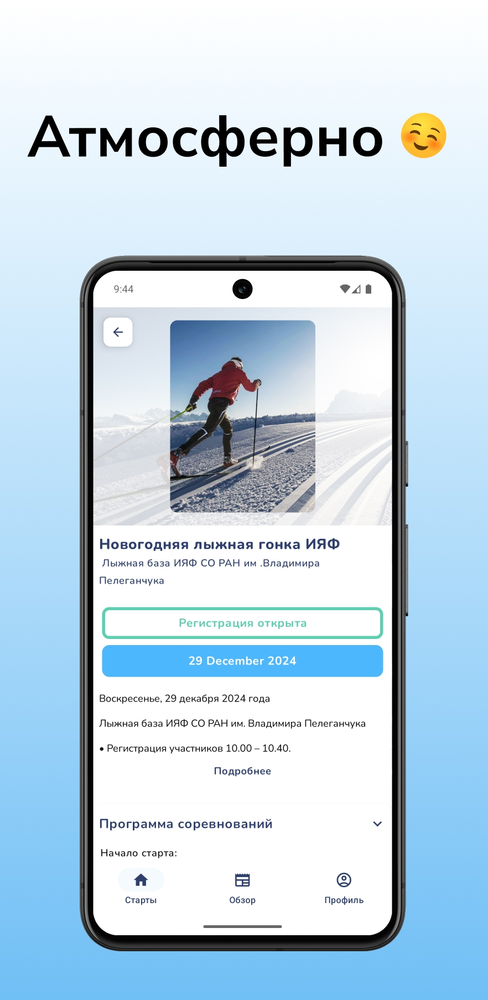
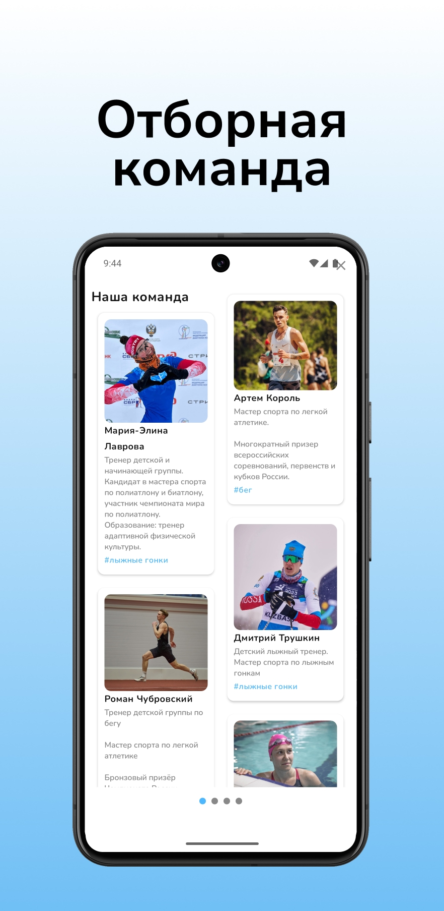
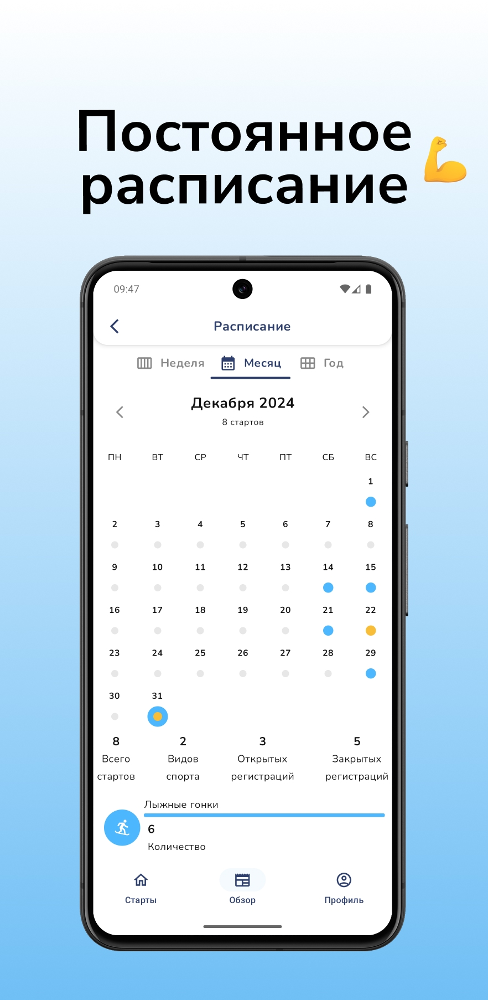

# Sportsauce App

Welcome to the **Sportsauce App** – an application designed for working with the website **sportsauce.ru**. This app helps users easily interact with various sports data and events provided on the platform.

## Screenshots

Below are some screenshots of the app:

    
    
    
    

## Description

This is a Kotlin Multiplatform project that provides functionality for displaying and interacting with data from **sportsauce.ru**.

### Main Features:
- Integration with **sportsauce.ru**.
- Viewing schedules and results.
- A convenient user interface for mobile devices.

## Google Play Link

If you want to install the app on your Android device, click the image below:

## Installation

1. Download and install the app on your device.
2. Open the app and start enjoying the sports data.
3. For more information, visit the website [sportsauce.ru](https://sportsauce.ru).

## Tech Stack

- **Kotlin Multiplatform** for building cross-platform apps.
- **Jetpack Compose** for building the UI.
- **Decompose**.