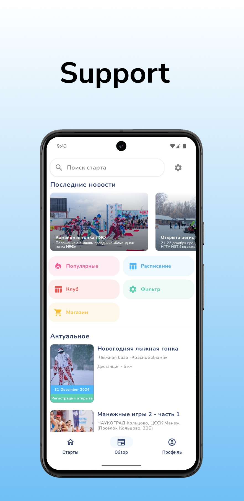
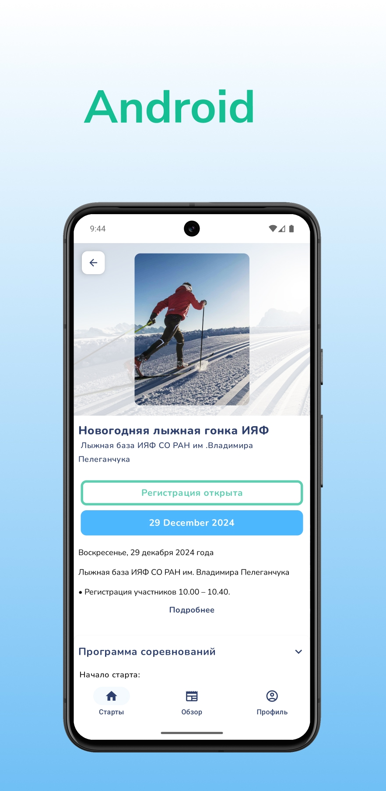
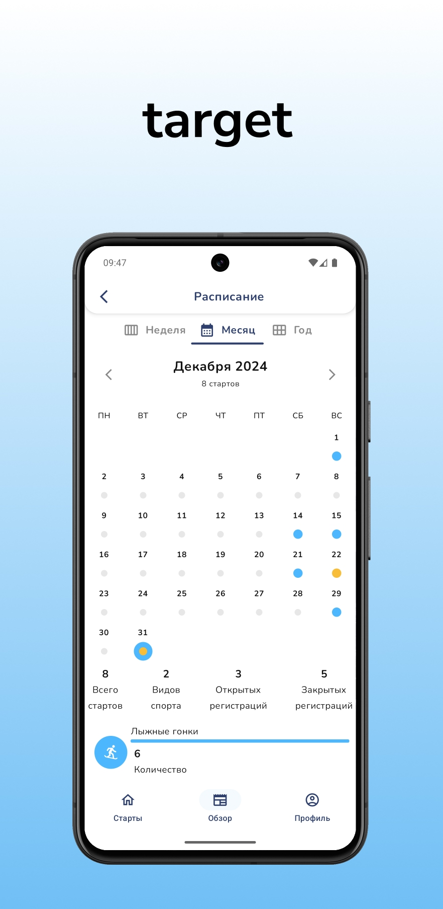
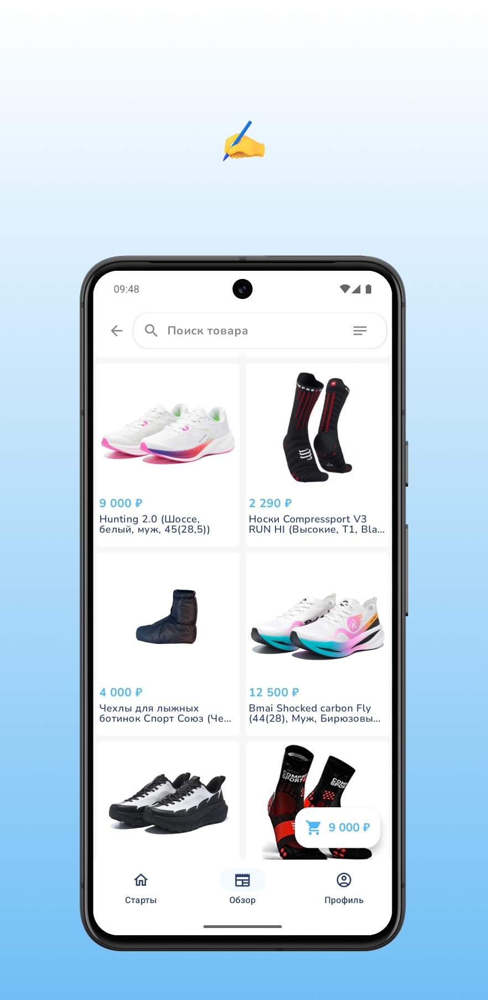
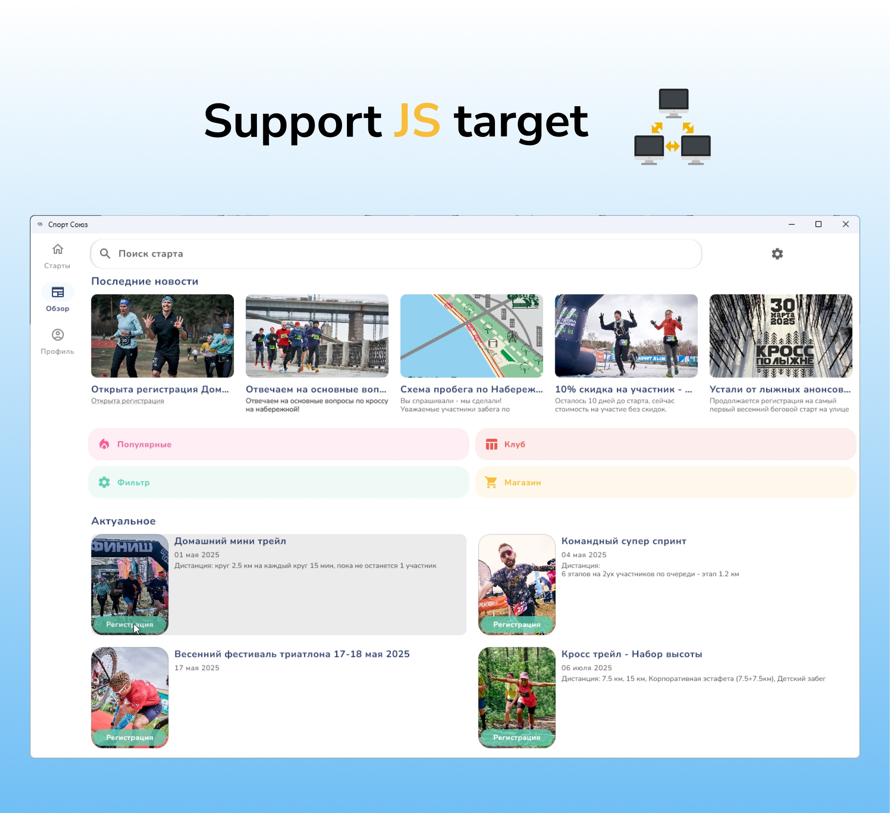
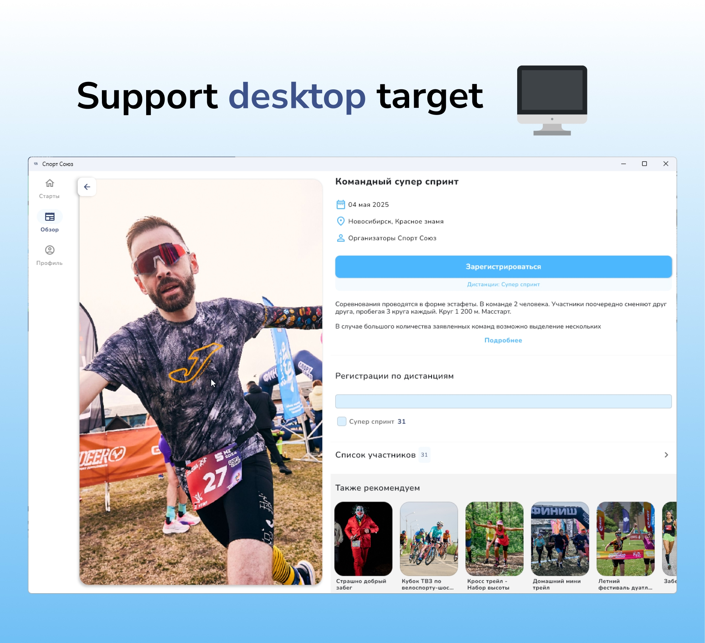

# Sportsauce

Welcome to the **Sportsauce App** – an application designed for working with the website **sportsauce.ru**. This app helps users easily interact with various sports data and events provided on the platform.

## Screenshots

Below are some screenshots of the app:

    
    
    
    

## Description

This is a Kotlin Multiplatform project that provides functionality for displaying and interacting with data from **sportsauce.ru**.

### JS

  

### Desktop

  

## Download
<table style="width:100%">
  <tr>
    <td>
  </tr>
</table>

## Tech Stack 📚
- [Kotlin Multiplatform](https://kotlinlang.org/lp/multiplatform/)
- [Compose Multiplatform](https://www.jetbrains.com/lp/compose-multiplatform/)
- [Kotlin Coroutines](https://github.com/Kotlin/kotlinx.coroutines)
- [Koin](https://insert-koin.io/)
- [Coil](https://coil-kt.github.io/coil/)
- [Ktor](https://ktor.io/)
- [Decompose](https://github.com/arkivanov/Decompose)